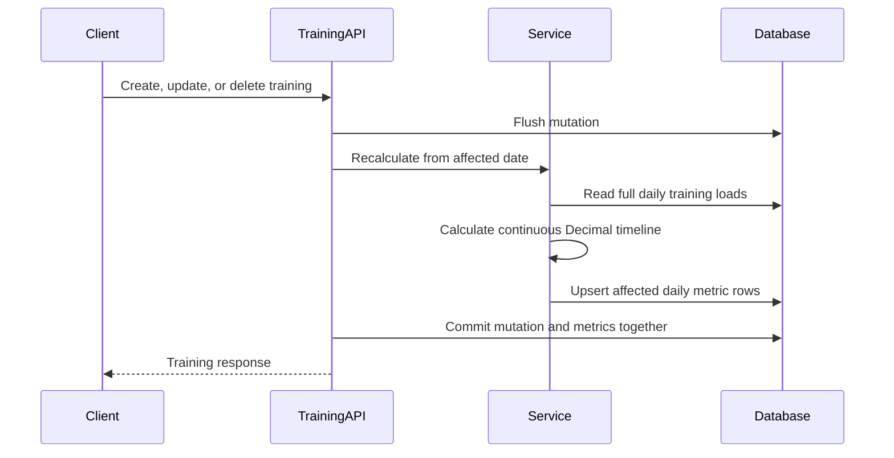

# Performance Manager

## Purpose and boundaries

The Performance Manager turns an athlete's training history into a continuous daily load timeline. The domain calculator is framework-independent, the service coordinates persistence, the repository owns SQL queries, and FastAPI routes expose authenticated read and recovery operations. The frontend consumes only those API contracts and never recalculates physiological metrics.

## Data model

`daily_performance_metrics` contains one row per athlete and calendar day. A unique constraint and composite index on `(user_id, metric_date)` prevent duplicates and support range reads. The table stores:

- daily TSS;
- CTL, ATL and TSB;
- rolling 7- and 28-day TSS;
- rolling 7- and 28-day training hours;
- 7-day CTL ramp rate;
- created and updated timestamps.

All calculated values use `NUMERIC(14, 6)` in PostgreSQL. Python calculations use `Decimal` and retain full intermediate precision; response serializers round to two decimal places for presentation.

## Formulas

For day `d`, daily load `L`, CTL time constant `Tc` and ATL time constant `Ta`:

```text
CTL[d] = CTL[d-1] + (L[d] - CTL[d-1]) / Tc
ATL[d] = ATL[d-1] + (L[d] - ATL[d-1]) / Ta
TSB[d] = CTL[d-1] - ATL[d-1]
Ramp[d] = CTL[d] - CTL[d-7]
```

Defaults are `Tc = 42` and `Ta = 7`; both can be set with `CTL_TIME_CONSTANT_DAYS` and `ATL_TIME_CONSTANT_DAYS`. Initial CTL and ATL are zero. Ramp rate is zero until seven prior calendar days exist. Multiple sessions on the same day are aggregated before applying the formulas.

The 7- and 28-day totals are trailing calendar windows including the current day. Duration is stored by training in minutes and converted to Decimal hours during aggregation.

## Recalculation flow



The engine calculates from the athlete's first training so every later value has the correct historical state. The service writes only rows on or after the requested affected date. Moving the first training forward removes obsolete earlier metric rows. Deleting the final training clears the athlete's metrics. Any calculation or persistence failure rolls back the training mutation and metric writes together.

`POST /api/v1/performance/recalculate` supports a complete rebuild when `start_date` is omitted and an affected-date rewrite when supplied. Upsert semantics make the operation idempotent, and service logs record user, row count and date boundaries without logging tokens or personal training notes.

## API

All routes require a bearer JWT and scope data to the authenticated athlete.

### `GET /api/v1/performance/summary`

Returns the latest CTL, ATL, TSB, 7- and 28-day TSS, 7- and 28-day training hours, 7-day ramp rate and 28-day CTL change. An athlete with no history receives explicit zero values.

### `GET /api/v1/performance/chart`

Returns chronological daily chart points with date, daily TSS, CTL, ATL, TSB and ramp rate. Presets are `28d`, `90d`, `180d` and `365d` through the `range` query parameter. Optional `start_date` and `end_date` override the preset boundaries. Future end dates, reversed boundaries, unknown presets and windows longer than 365 days return validation errors. A valid window with no history returns an empty points array.

### `POST /api/v1/performance/recalculate`

Accepts an optional ISO `start_date` and returns the effective first and last recalculated dates plus the rows written. With no training history, both dates are null and the row count is zero.

Swagger documents and exercises these contracts at `/docs`; the raw OpenAPI schema is available at `/openapi.json`.

## Dashboard behavior

The dashboard loads summary and chart data together. Cards show current load, trailing totals and ramp indicators; the responsive composed chart overlays daily TSS bars, CTL/ATL lines and a TSB area. Range buttons reload the selected server-side window. Loading skeletons, an actionable retry state and a no-history explanation replace fabricated production data. The chart includes an accessible data table for non-visual consumers.

## Edge cases and operational notes

- Rest days are persisted with zero daily TSS and decaying CTL/ATL.
- A `null` training TSS contributes zero; no load is inferred.
- Concurrent duplicate metric rows are prevented by the database unique constraint.
- Dates are athlete calendar dates; timezone-aware activity ingestion should normalize into an athlete-local date before creating a training.
- Configuration changes to CTL or ATL constants require a full recalculation of existing athletes.
- The current calculation is synchronous with training CRUD. Large imported histories should use a durable background job while preserving the same service and transaction/idempotency contract.

## Future provider integrations

Garmin and TrainingPeaks adapters should live outside the performance domain. Each adapter should normalize external activities into the existing training input, retain a provider activity identifier for deduplication, and batch mutations before one recalculation from the earliest affected date. OAuth credentials, webhook signatures, rate limits and retry state belong in provider-specific infrastructure. The calculation engine and performance API remain unchanged, which also keeps imported and manually entered training behavior consistent.
